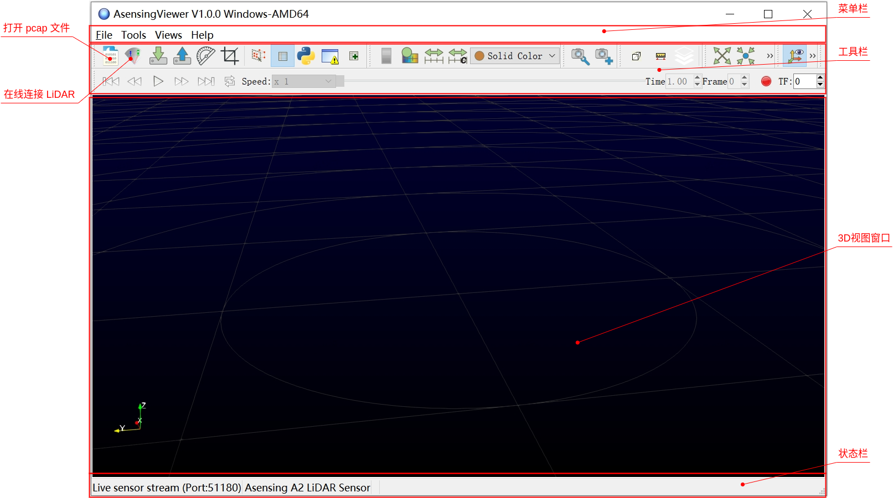
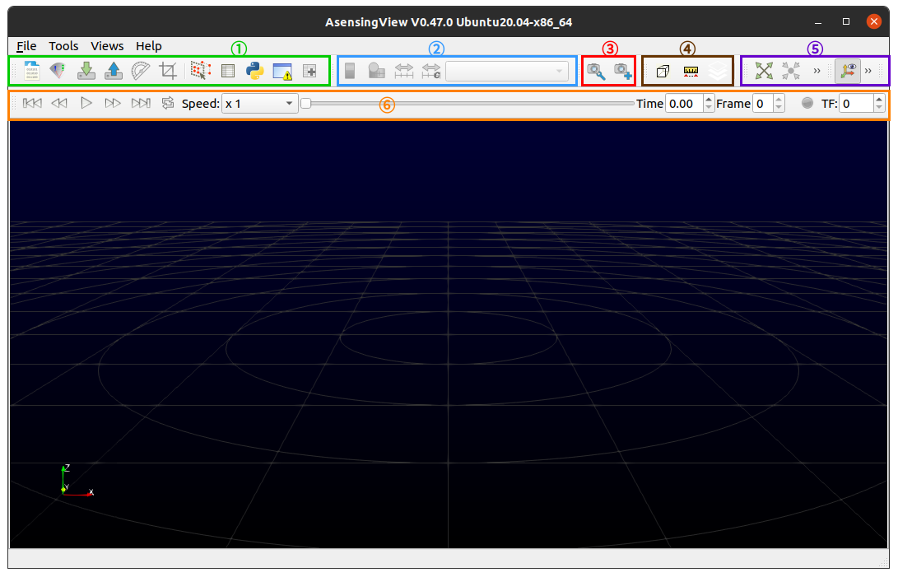
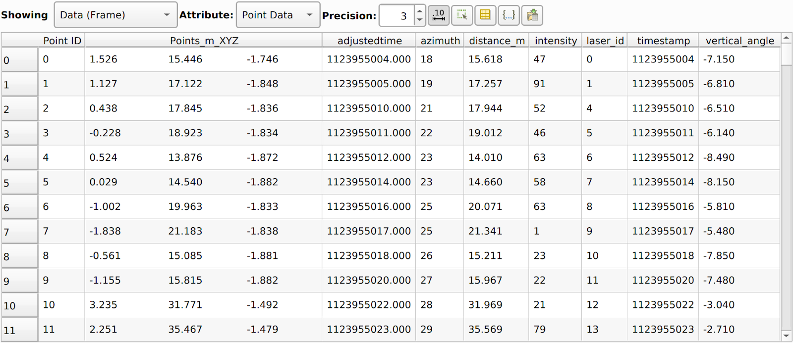
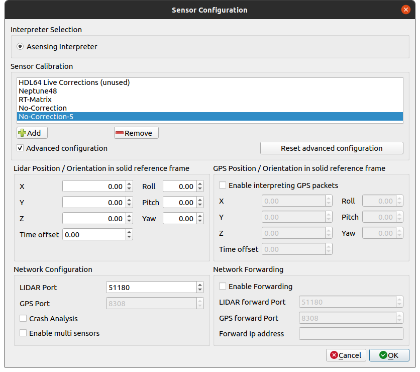
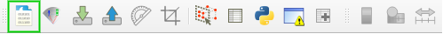
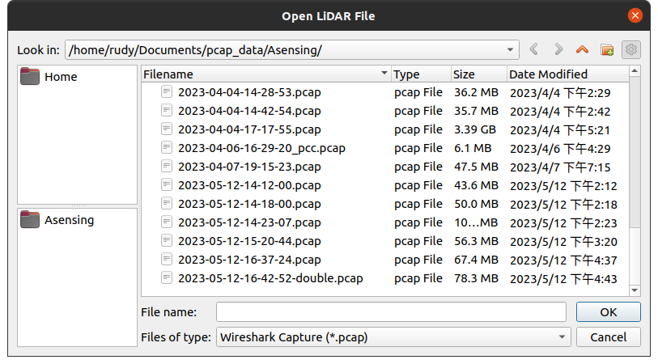

# AsensingViewer 用户手册


## 1. 概述

NeptuneViewer 是导远电子提供的一款 LiDAR 点云显示软件，目前支持 A0 激光雷达点云数据的实时捕获、数据可视化、数据过滤处理。同时，NeptuneViewer 可以将实时流录制为 .pcap 格式文件，并播放存储在 .pcap 文件中的预先录制的点云数据。



本手册的后续内容，将假设读者已经对导远电子的激光雷达传感器（A0）有一定的了解。

### 1.1 名词解释

- **Frame**：点云数据帧，表示一个扫描期间获取的所有数据点的聚合（例如：机械式激光雷达完整的 360° 扫描）。
- **GUI**：图形用户界面，用户可以通过鼠标和键盘交互的软件窗口和按钮等。
- **Pcap**：点云数据的录制格式，.pcap 文件是包含从某个端口接收到的原始网络数据包的数据文件。
- **Python shell**：Python 是一种解释器编程语言，这意味着它逐行执行代码。Python shell 是交互式控制台，用于执行用户提供的 Python 命令。
- **RPM**：Rotations Per Minute，对于机械式激光雷达，为当前旋转速度，对于固态激光雷达，为等效的扫描帧率。
- **点云**：是指目标表面特性的海量点集合。根据激光测量原理得到的点云，包括三维坐标（XYZ）和激光反射强度（Intensity）。在获取物体表面每个采样点的空间坐标后，得到的是一个点的集合，称之为“点云”(Point Cloud)。
- **实时模式**：连接激光雷达，实时接收和处理点云数据，并做可视化展示。
- **回放模式**：读取解析录制的 .pcap 格式点云数据文件，并做可视化展示。


### 1.2 软件安装

AsensingViewer 提供 Windows 和 Linux 两个系统平台的软件安装包，可以从服务器 `\\10.1.135.58\share` 获取。

下面介绍安装方法。

#### 1.2.1 Windows 系统

下载 AsensingViewer 安装包，如 AsensingViewer-V1.0.0-Windows-AMD64.exe，双击该 exe 文件，点击 Next 选择安装位置即可开始安装。


另外，你也可以通过“软件超市”安装 AsensingViewer 应用程序。

#### 1.2.2 Linux 系统

下载 AsensingViewer 安装包，如 AsensingViewer-V1.0.0-Ubuntu20.04-x86_64.tar.gz，切换到你想要安装的目录，并解压缩该文件：

```bash
cd ~/bin/
tar zxvf AsensingViewer-V1.0.0-Ubuntu20.04-x86_64.tar.gz
```

解压完成后，进入 bin 目录执行 `./AsensingViewer` 即可启动上位机程序。


## 2. 软件功能

下面介绍 AsensingViewer 上位机软件的功能，主要从数据可视化、工作模式、工具栏常用工具等方面展开。

### 2.1 数据可视化

AsensingViewer 作为一个点云数据展示软件，最主要的功能就是数据可视化和分析，而承托这两个功能的分别是 3D 视图窗口和电子表格窗口。

#### 2.1.1 主 3D 视图

首先，我们一起来看看 AsensingViewer 的图形用户界面（GUI）。NeptuneViewer 软件包含了多组工具栏（将在 2.3 节工具栏部分详细介绍）和两个不同的视图（View）—— 主 3D 视图和电子表格（Spreadsheet）视图。

主视图在交互式查看器中显示 3D 点云（point-cloud），如下图所示。



工具栏的简单介绍如下：

- ① 绿色：基本控制
- ② 蓝色：颜色控制
- ③ 红色：自定义视点
- ④ 棕色：设置视图控件
- ⑤ 紫色：视图和相机控件
- ⑥ 橙色：播放控件

在3D交互界面中，你可以使用鼠标（mouse）或触控板（trackpad ）来移动、缩放或旋转 3D 视图。另外使用辅助键与单击组合可以提供更多功能，下表总结了主视图的多种控制方式：

|          | 左键               | 中键                 | 右键                  | 滚轮（鼠标）或双指（触控板） |
| -------- | ------------------ | -------------------- | --------------------- | ---------------------------- |
| 无辅助键 | 围绕中心旋转       | 在正交平面上移动焦点 | 放大/缩小             | 放大/缩小                    |
| Ctrl +   | 放大/缩小          | 围绕中心旋转         | 放大/缩小（幅度更大） | 放大/缩小，以光标位置为中心  |
| Shift +  | 绕正交平面法线旋转 | 围绕中心旋转         | 在正交平面上移动焦点  | 放大/缩小                    |


#### 2.1.2 电子表格视图

电子表格视图展示主3D视图中的数据，它能够实时更新数据，并以电子表格的形式显示。默认情况下该窗口是隐藏的，但可以通过单击工具栏中的 *Spreadsheet* 按钮（或通过菜单栏 Views -> SpreadSheet）来激活。



电子表格视图上方的选项从左到右分别是：要显示的数据、要显示的属性、精度、切换科学表示、仅显示选定点、切换列可见性、切换单元格连接可见性、导出电子表格。

该视图对于检查原始数值数据、在某些数值字段条件上选择点、将此数据导出到 CSV 文件等功能很有用。

提示：点击表格的列标题，可以切换行的排列顺序。

### 2.2 工作模式

AsensingViewer 有两种工作模式：实时模式与回放模式。

- **实时模式** 的使用场景是激光雷达通过网络直接与 AsensingViewer 上位机连接，这种模式能够实时可视化激光雷达输出的数据。
- **回放模式** 的使用场景是用户通过之前录制的 .pcap 数据文件，重新读取数据进行可视化，用于展示和分析 LiDAR 数据。
#### 2.2.1 实时模式

将 LiDAR 连接到 AsensingViewer 运行的计算机网络中，单击工具栏中的 *Sensor Stream* 按钮，或通过菜单栏 File -> Open -> SensorStream。


此时将会打开 *Sensor Configuration* 传感器数据流和配置窗口，在这里你需要选择对应的解析器和标定文件（A0 暂时使用 No-Correction-5）。如果勾选高级配置（advanced configuration）复选框，你还可以修改端口号等网络参数。



点击 OK 开始接收并显示点云数据。

在实时流运行时，你可以将数据流暂停到特定帧或将流录制到 .pcap 文件中。


注：绿框处为数据流暂停按钮，红框处为数据流录制按钮。

#### 2.2.2 回放模式

回放模式适用于离线分析，也就是说，不需要将 LiDAR 连接到 NeptuneViewer 运行的计算机网络中。单击工具栏中的 *Open Data File* 按钮（或通过菜单栏 File -> Open -> Capture File）。



选择之前所保存的.pcap文件，点击 Ok。



此时会打开 *Sensor Configuration* 传感器数据流和配置窗口，配置解析器等信息后点击 OK 即可。

### 2.3 NeptuneViewer 工具栏


#### 2.3.1 基本控制

打开.pcap文件：

打开之前传感器所保存的数据。

打开实时模式：

实时使用UDP接收正在连接的传感器发出的数据。

保存传感器参数数据：

读取传感器参数数据：

配置传感器解析器与校准方法：

如图Figure 5可知。

裁剪点云：

此功能是您能够裁剪点云的一部分，以仅保留属于想要的点云数据。

选择点：

点击按钮后在3D视图中框选感兴趣点。

电子表格视图：

打开电子表格视图。

python控制器：

打开python控制器。

错误控制器：

打开错误控制器。

（用不出功能）

#### 2.3.2 播放控件

在回放模式时，该控件能够进行播放、快进、回放、改变倍速播放等功能


回到开始：

回到所打开.pcap文件的第一帧。

回到上一帧：

回到所打开.pcap文件中当前帧的上一帧。

开始/停止:

开始或者停止.pcap文件的回放。

去下一帧：

回到所打开.pcap文件中当前帧的下一帧。

去到结束：

回到所打开.pcap文件的最后一帧。


循环：

循环回放.pcap文件。

速度：

控制回放模式速度。

滑动选择帧：

滑动选择感兴趣帧。

时间与帧数：

能够显示当前回放时间与帧数，并且能修改后回放。

添加帧残影：

Figure 8 TF分别为1与50


能够增加点云数目。

#### 2.3.3 颜色控件

颜色图例：

在3D视图中展示颜色信息对应渲染图中数据值。


Figure 8: 颜色图例

编辑颜色索引：

编辑和更改数据颜色索引。


重新缩放数据：

重新缩放色彩映射表，以便颜色极值对应于数据值极值

自定义重新缩放：

根据需要重新缩放颜色映射表。如果您的数据具有较大的范围值，则此功能非常有用。能够让主要部分信息位于子范围值中。

选择数据类型：

更改用于颜色编码的数据信息。默认情况下以每个激光雷达返回的强度为显示值。


Figure 10: 显示数据类型

#### 2.3.4 视图和传感器控件


#### 2.3.5 设置视图控件

正交视图：

从透视视图切换到正交视图。

测量距离： 

按住键的同时 `Ctrl` 键，按住鼠标左键开始在3D内绘制一条线视图，以测量其距离。当鼠标位于所需位置。此功能仅在激活正交视图时才有效。

平面拟合工具： 

通过已选点拟合平面。

重置相机： 

将相机重置为其初始位置和方向。

设置视图方向：

将相机查看方向设置为 x、y 或 z 轴。


#### 2.3.6 自定义视点

增加视点：

通过增加视点能够回到之前查看点云视角。

查看之前增加的视点：


Figure 11:视点界面


#### 2.3.7 工具菜单


### 2.4 导出数据

依次点击File->Save as选择pcap、csv、pcd、ply、las等存储结构。

Figure 12: 选择保存帧数

选择保存 当前帧/所有帧/自定义帧数，点击ok。


## 3. 常见问题

### 3.1 Windows 网络设置

LiDAR 在出厂是设定的目标 IP 地址是 192.168.101.255，即广播地址。因此默认情况下需要设定计算机的静态 IP 地址为 192.168.101.xxx，子网掩码为 255.255.255.0。此外还需要确保 NeptuneViewer 软件没有被防火墙或第三方安全软件隔离。

### 3. 2 Ubuntu 虚拟机网络配置

将虚拟网卡设置为桥接模式。

首先需要虚拟机是关闭状态。在然后需要弄清楚自己物理机在局域网内的ip、掩码、网关等。
 在物理机的CMD窗口内 输入 ipconfig /all。


Figure 13: 物理机局域网数据


网卡：Inter（R） Wi-Fi 6 AX201 160MHz
 局域网的IP地址：192.168.1.218

子网掩码:255.255.255.0
 网关：192.168.1.1
 DNS：192.168.1.1


点击编辑->虚拟网络编辑器->选择桥接模式（已桥接至物理机网卡）

点击虚拟机->虚拟机设置->在网络适配器中选择桥接模式->勾选复制物理网络连接状态


Figure 14: 选择虚拟网络编辑器


Figure 15: 虚拟网络编辑器


Figure 16: 虚拟机设置


根据宿主机的配置信息设置Ubuntu的netplan配置文件


修改完之后要应用一下netplan


### 3.3 如何修改点云颜色

点击出现Color Map Editor，点击1后选择颜色。


Figure 17: 颜色编辑器


Figure 18: 选择颜色类型


### 3.4 如何调整点云大小

依次点击菜单栏中的 Views -> Display，打开 Display 选项卡，在 Representation 中选择 Points，修改 Styling 组中的 Point Size 值。

点击 Display 选项卡上方的“保存”按钮（Save）将当前显示配置值保存为默认值，点击“重置”按钮（Restore）恢复初始默认值。

- Save current display settings values as default
- Restore application default setting values for display

