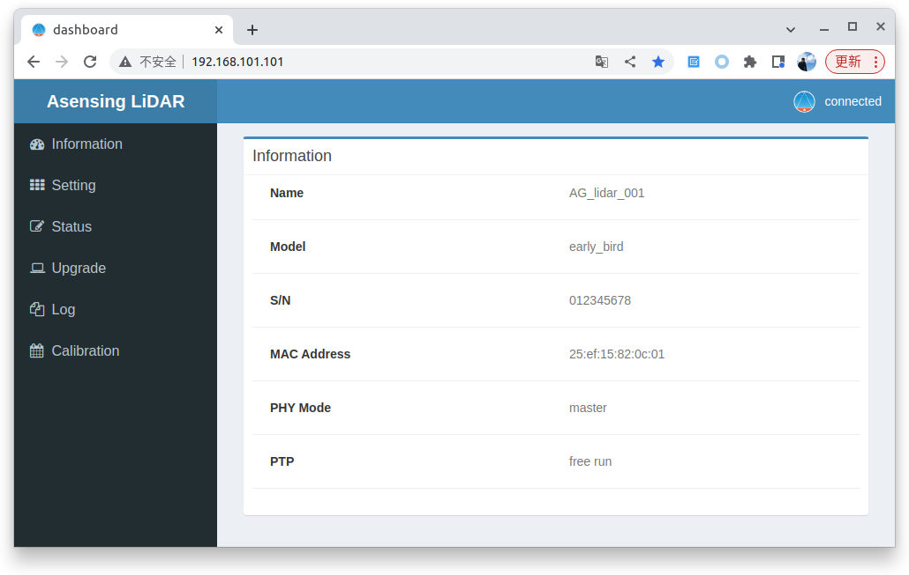

# A2 激光雷达用户手册

:::warning 安全提示：

- 本产品是 Class 1 激光产品，激光安全等级符合 IEC/EN 60825-1: 2014 标准。
- 使用本品规定之外的控件、调节方法或工作步骤，可能导致有害的辐射泄漏，操作时务必遵守规范。
- 当怀疑产品已出现故障，或使得周围的人员感到任何不适、使周围设备运行异常时，请立即停止使用。

:::

## 产品介绍

本手册介绍了 A2 激光雷达的技术参数、安装、连接、配置、标定及数据输出格式等。

### 工作原理

（待补充）

### 结构描述

（待补充）

### 线束分布

（待补充）

### 技术参数

（待补充）

## 安装

### 机械安装

（待补充）

### 接口

（待补充）

### 接线盒

（待补充）

## 使用

（待补充）

## 通信协议

通信协议目前指的是 LiDAR 与上位机之间传输点云或设备状态信息的通信协议。

注意：协议中的多字节字段按小端字节序排列。

### 点云数据包

#### 以太网包头

LiDAR 点云数据包使用 UDP 协议传输，默认的目标端口是 51180。默认源 IP 地址为 192.168.101.101，目的 IP 地址为 192.168.101.255，即广播形式。

#### UDP 数据头

点云数据头部一共 40 字节，包含字段信息说明如下。

| 字段                  | 字节数 | 说明                                                         |
| --------------------- | ------ | ------------------------------------------------------------ |
| Sob                   | 4      | 消息识别头，固定为 0xAA、0x55、0xA5、0x5A                    |
| Frame ID              | 4      | 帧号，表示当前数据属于第几帧（从 0 开始累加）                |
| Sequence Number       | 2      | 序列号，表示当前数据包在一帧数据中的位置（每帧数据的第一包均为 0） |
| Packet Length         | 2      | 包长，表示点云数据包的净荷长度                               |
| Lidar Type            | 2      | 雷达类型，用于区分产品型号                                   |
| Protocol Version      | 2      | 协议版本，用于区分通信协议版本                               |
| Timestamp             | 10     | 绝对时间，前 6 个字节表示“年月日时分秒”，后 4 个字节表示绝对时间的微秒部分（范围：0 - 99999 us） |
| Measurement Mode      | 1      | 测量模式，例如城市道路、高速等模式                           |
| Laser Number          | 1      | 激光通道数，A0 型激光雷达固定为 8 通道                       |
| Block Number          | 1      | 数据包中的 Block 数量，一个 Block 可看作具有相同时间的点云集合 |
| Wave Mode             | 1      | 回波模式，例如单回波、双回波等模式                           |
| Time Sync Mode        | 1      | 时间同步模式 1. 使用系统内部时间 2. 1 pps 进行亚秒在整秒复位模式 3. PTP 时间同步模式 |
| Time Sync State       | 1      | 时间同步状态                                                 |
| MEMS Temperature      | 1      | 激光雷达 MEMS 温度                                           |
| Slot Number           | 1      | 槽位号，用于区分多个同类型产品的不同槽位                     |
| Point Number in Frame | 4      | 一帧点云中点的总数                                           |
| Reserved              | 2      | 预留                                                         |

#### UDP 数据主体

（待补充）

#### UDP 数据尾

（待补充）

### 点云数据解析示例

（待补充）

## 网页控制

LiDAR 内置了 Web 服务器，通过网络浏览器打开 `http://192.168.101.101` 即可访问 Web 配置界面。

## 上位机

LiDAR 配套一个点云展示上位机软件 AsensingView，可用于实时显示 3D 点云数据，同时可以录制、回放、导出点云数据，帮助分析或处理来自 LiDAR 的点云数据。

AsensingView 提供实时模式与回放模式两种数据可视化模式，可通过工具栏左侧按钮进行选择。其中，实时模式的使用场景是 LiDAR 通过网络直接与上位机连接，这种模式能够实时可视化 LiDAR 输出的数据。回放模式的使用场景是用户通过之前录制的 .pcap 数据文件，重新读取数据进行可视化，用于展示和分析 LiDAR 数据。

关于上位机的详细使用说明，请参考《[AsensingView使用手册](/AsensingDocs/lidar/AsensingViewer_User_Manual)》。

